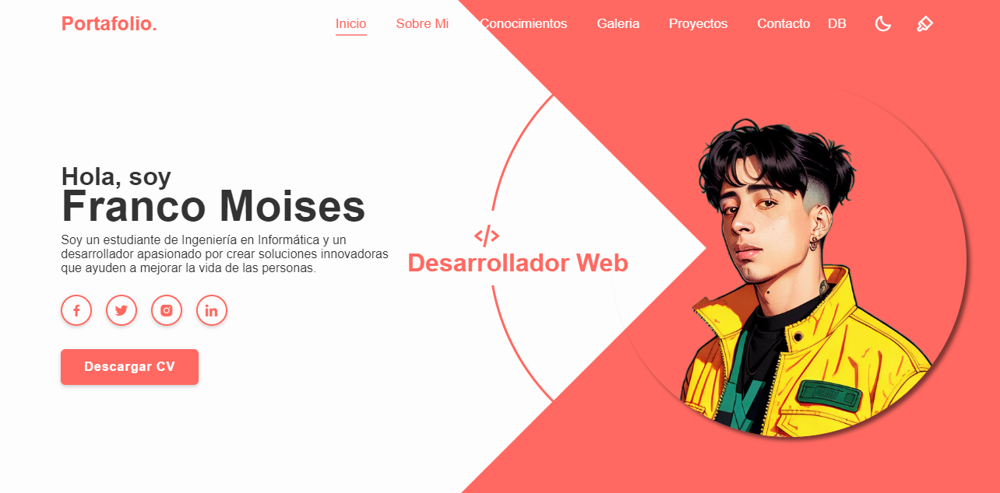

# 🌐 Mi Portafolio Web 2023

¡Hola! 👋 Este es un proyecto de portafolio web personal universitario desarrollado en 2023. 🚀 Combina diseño elegante y funcionalidad básica para mostrar mis habilidades en desarrollo web front-end con una pequeña integración de backend.

## 🛠️ Tecnologías utilizadas  
- **HTML5**, **CSS3** y **JavaScript** para la interfaz y el diseño web. 🎨  
- **SQL Server** para manejar una base de datos simple. 🗄️  
- **Google Charts** para visualizar datos dinámicos de manera interactiva. 📊  

## ✨ Características principales  
- 📋 Presentación de habilidades y proyectos personales.  
- 🎯 Uso de estilos CSS personalizados y efectos interactivos en JavaScript.  
- 🔗 Integración con Google Charts para gráficos dinámicos.  
- 🗂️ Conexión a una base de datos SQL Server para manejar información básica.  

## 🌟 Por qué este proyecto es especial  
Este portafolio no solo muestra mis habilidades técnicas, sino que también refleja mi pasión por el desarrollo web. Es un ejemplo práctico de cómo combinar tecnologías front-end y back-end en un proyecto sencillo y funcional.

## 🖥️ Vista previa  
Siéntete libre de explorar el código o probar el proyecto en tu máquina local. Estoy abierto a comentarios y sugerencias. 🤗  
Puedes visitar la pagina en https://fjmoisesromero.github.io/Portafolio/LandingPage.html
---

# 🌐 My Web Portfolio 2023

Hello! 👋 This is my personal web portfolio university project, developed in 2023. 🚀 It combines sleek design and basic functionality to showcase my front-end web development skills with a touch of backend integration.

## 🛠️ Technologies used  
- **HTML5**, **CSS3**, and **JavaScript** for the interface and web design. 🎨  
- **SQL Server** to handle a simple database. 🗄️  
- **Google Charts** for dynamic and interactive data visualization. 📊  

## ✨ Main features  
- 📋 Presentation of skills and personal projects.  
- 🎯 Custom CSS styling and interactive JavaScript effects.  
- 🔗 Integration with Google Charts for dynamic visualizations.  
- 🗂️ Connection to an SQL Server database for managing basic information.  

## 🌟 Why this project is special  
This portfolio not only showcases my technical skills but also reflects my passion for web development. It serves as a practical example of combining front-end and back-end technologies in a simple yet functional project.

## 🖥️ Preview  
Feel free to explore the code or try out the project on your local machine. I'm open to feedback and suggestions! 🤗  
You can visit the page in https://fjmoisesromero.github.io/Portafolio/LandingPage.html

---

